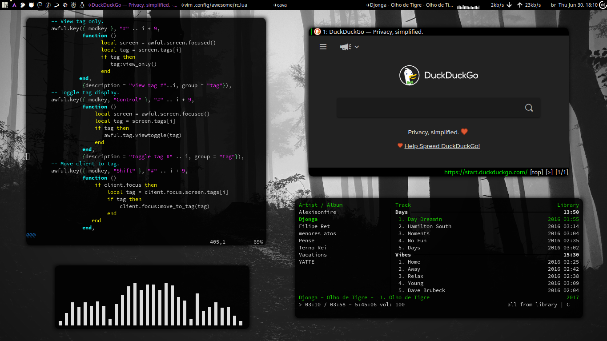

### AwesomeWM Rice
                                           
### Requirements
- **`Awesome`**
- **`Nerd-Fonts-Complete`** [Aur](https://aur.archlinux.org/packages/nerd-fonts-complete)
- **`Awesome-wm-widgets`** [Git](https://github.com/streetturtle/awesome-wm-widgets)
- **`Kitty`**
- **`Dmenu`**
- **`Flameshot`**
- **`Rofi`**
- **`Nitrogen`**
- **`Picom`** [AUR](https://aur.archlinux.org/packages/picom-ibhagwan-git)
